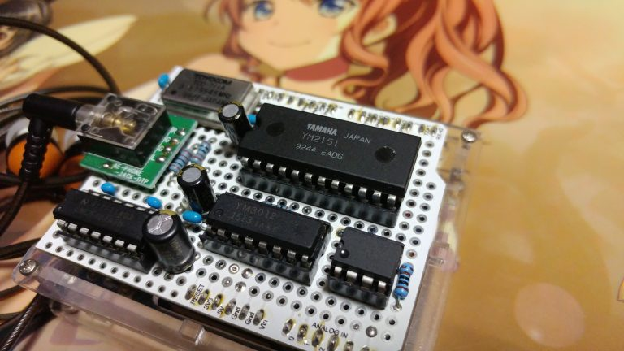
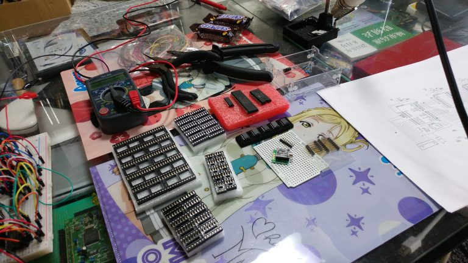

# arduino-vgmplayer

Play back the VGM format file with Arduino. (only YM2151)

## Schematic

### Arduino-YM2151 Block

@see YM2151.h

```c
static	const	uint8_t		YM_PIN_D0=2;
static	const	uint8_t		YM_PIN_D1=3;
static	const	uint8_t		YM_PIN_D2=4;
static	const	uint8_t		YM_PIN_D3=5;
static	const	uint8_t		YM_PIN_D4=6;
static	const	uint8_t		YM_PIN_D5=7;
static	const	uint8_t		YM_PIN_D6=8;
static	const	uint8_t		YM_PIN_D7=9;

static	const	uint8_t		YM_PIN_RD=10;
static	const	uint8_t		YM_PIN_WR=11;
static	const	uint8_t		YM_PIN_A0=12;
static	const	uint8_t		YM_PIN_IC=13;
```

```
YM_PIN_VSS(1/11)    GND
YM_PIN_CS(7)        GND
YM_PIN_VDD(22)      5V
```

### YM2151-YM3012-Audio Block

@see https://www.slideshare.net/nanase_t/ym2151fm (page-28)

## Thanks

* [Web::ooISHoo YM2151Shield](http://www.ooishoo.org/wordpress/project/ym2151shield/)
* [YM2151.cpp](https://github.com/ooISHoo/Arduino_YM2151/blob/develop/SketchMDXPlayer/YM2151.cpp)
* [YM2151でFM音源演奏](https://www.slideshare.net/nanase_t/ym2151fm)
* Create VGM file [mml2vgm](https://github.com/kuma4649/mml2vgm)

## Enjoy

* Add EEPROM version





* [https://www.youtube.com/watch?v=pdUrtxhG2Cw](https://www.youtube.com/watch?v=pdUrtxhG2Cw)
